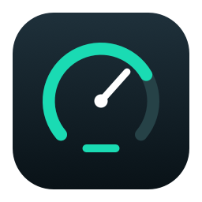
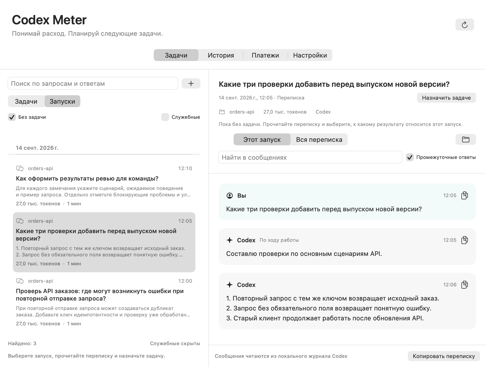
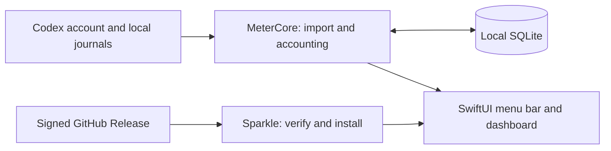

<div align="center">



# Codex Meter

**Know your Codex budget. Plan the next task.**

A native macOS menu bar app for OpenAI Codex usage, subscription quotas,
token tracking and task-level cost estimates.

[](https://github.com/ZeraiGR/codex-meter/actions/workflows/checks.yml)
[](https://github.com/ZeraiGR/codex-meter/releases/latest)


[Download](https://github.com/ZeraiGR/codex-meter/releases/latest) ·
[Русский](README.ru.md) · [Usage guide](docs/usage.ru.md) ·
[Updates & release pipeline](docs/updates.md) ·
[Report an issue](https://github.com/ZeraiGR/codex-meter/issues)

</div>

## Your quota, one click away

See how much Codex quota remains, when it resets and how usage compares with the
time left in the current quota window. No separate API key or paid API account.

<p align="center"></p>

[Dark appearance](docs/images/menu-bar-dark.png).

Screenshots use synthetic example data. The current interface is in Russian.
The panel uses an opaque background and adapts to macOS light and dark appearance.
Saving, assigning runs and merging tasks show progress and block repeated actions
until the displayed statistics are current.

## Understand the work behind the numbers

A task is an outcome, such as reviewing an API or building a feature. It can span
multiple prompts, sessions and helper skills. Group related runs, read the conversation
and compare the time, tokens and measured quota used by each task.


| Question | What Codex Meter shows |
| --- | --- |
| How much can I use now? | Remaining subscription quota and reset time, with data freshness. |
| Am I using it too quickly? | Quota remaining alongside time remaining in the same window. |
| Which tasks use the most? | Sort by tokens, active time, measured cost, weekly quota, activity or title. Filter by status and task type. |
| What did this run do? | Requests and responses from local Codex journals, with text search and copy. |
| What did a task cost? | Its measured share of the payment you entered, with partial coverage and a separate approximate total. |
| Will a similar task fit? | Historical estimates for recurring task types, with uncertainty and risk labels. |
| Is there a newer version? | Signed update checks, a menu indicator and a notification when allowed by macOS. |



## Install

1. Download the universal ZIP from [the latest release](https://github.com/ZeraiGR/codex-meter/releases/latest).
2. Unzip and move **Codex Meter.app** into `~/Applications` or `/Applications`.
3. Open the app. Codex must already be installed and signed in with your subscription.
4. Allow notifications if you want quota and update reminders. Login launch is configurable.

**Apple notarization is not available for current releases.** The app is locally
code-signed and update archives have Ed25519 signatures, but those signatures do not
replace Apple Developer ID. macOS may block the first launch; use its per-app
approval flow only if you trust the downloaded release. Do not disable Gatekeeper.

Versions up to 1.3.2 have no updater. Install an updater-enabled version manually once.
After that, use **Settings → Updates** or **Check for updates…** in the menu.

### Track meaningful tasks

For automatic skill/task markers, install the optional local integration:

```sh
git clone https://github.com/ZeraiGR/codex-meter.git
cd codex-meter
python3 scripts/install-integration.py
```

The installer backs up your Codex configuration and preserves unrelated hooks.
Start a new Codex session after installation. Ask to start a named task; helper skills
and follow-up prompts can then contribute to the same outcome. Historical runs can
also be assigned manually. See the [usage guide](docs/usage.ru.md).

## Honest estimates

- **Quota is not a fixed token allowance.** The app cannot promise a number of remaining tokens.
- Quota comes from Codex account data; token counts come from available local journals.
- Task quota is attributed from consecutive measurements. Parallel or unobserved activity
  affects accuracy; missing measurements are shown explicitly.
- Cost is an allocation of your recorded subscription payment, currently in rubles.
  It is neither an API bill nor a refundable cash balance.
- A multi-week task may consume more than 100% of one weekly quota.
- Forecasts describe historical tasks; they do not guarantee the next task will finish.

## Local data and privacy

Tasks, payments, counters, short message excerpts and journal paths are stored in
`~/Library/Application Support/CodexMeter/meter.sqlite`. Full conversations are read
from original Codex journals on demand. The app does not upload your task history.

Network requests read Codex account usage and check/download releases from GitHub.
Sparkle system profiling is disabled. Data is not encrypted by the app and there is no
cloud synchronization. [Third-party notices](THIRD_PARTY_NOTICES.md). Never attach your real database or raw journals to a public issue.

## Build and verify

Requires macOS 14+, Swift 6 and Xcode Command Line Tools. Dependencies are downloaded
from pinned upstream artifacts and verified by SHA-256 before extraction.

```sh
git clone https://github.com/ZeraiGR/codex-meter.git
cd codex-meter
bash scripts/build-app.sh
open 'dist/Codex Meter.app'

# Universal Apple Silicon + Intel bundle, with the full quality pipeline:
METER_ARCHS='arm64 x86_64' bash scripts/check-quality.sh
```

Tests use temporary data. The pipeline covers accounting, journal import, tasks,
RPC failures, native UI interaction, release metadata and Sparkle installation.
Real update tests verify installation/relaunch, preservation of stored records,
corrupted archives, forged feeds, unavailable feeds and non-upgrades.

## Architecture



`MeterCore` owns accounting and persistence; the SwiftUI target owns the interface.
Sparkle owns authenticated update download, installation and relaunch. GitHub Actions
builds and tests on Apple Silicon and Intel before the release job can use the signing
key. [Release and recovery details](docs/updates.md).

Independent project; not affiliated with or endorsed by OpenAI. OpenAI and Codex
are trademarks of their respective owners.
