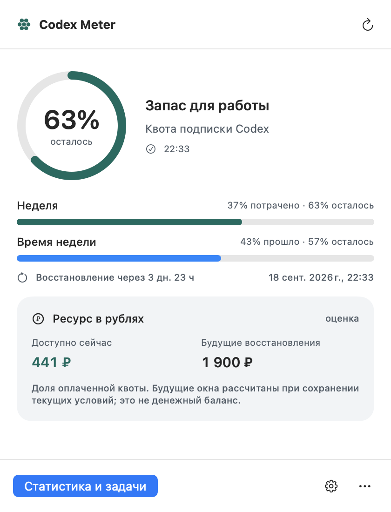
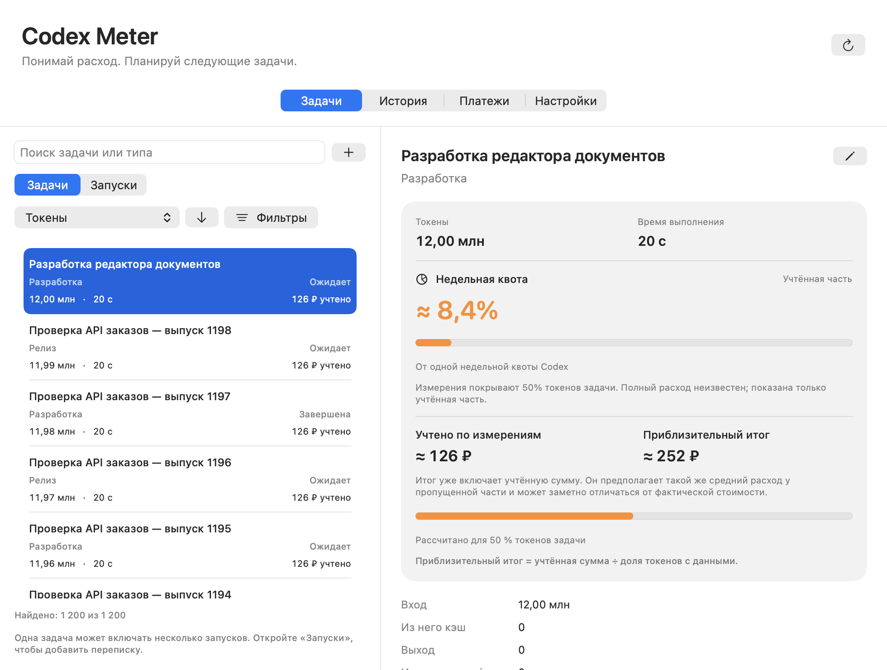

# Codex Meter

**Квота Codex, токены и стоимость задач — в строке меню macOS.**

[Скачать](https://github.com/ZeraiGR/codex-meter/releases/latest) · [English](README.md) ·
[Подробное использование](docs/usage.ru.md) · [Обновления и выпуск](docs/updates.md)

<p align="center"></p>

Приложение помогает планировать работу по подписке: сравнивать оставшуюся квоту
со временем до восстановления и видеть расход отдельных пользовательских задач.
Одна задача может включать несколько запросов, переписок и вспомогательных скиллов.

- Процент квоты, сроки восстановления и свежесть данных.
- Токены, время выполнения, учтённая стоимость и доля недельной квоты каждой задачи.
- Поиск, сортировка и фильтры для большой истории задач.
- Просмотр запросов и ответов перед назначением запуска задаче.
- Предупреждения о расходе и большом остатке перед восстановлением.
- Подписанные обновления через GitHub Releases с установкой из приложения.



Иллюстрации используют вымышленные данные. Нужны macOS 14+ и установленный Codex
с входом по подписке. Выпуск universal поддерживает Apple Silicon и Intel.
Отдельный платный API не требуется.

## Установка и обновление

Скачайте ZIP из [Releases](https://github.com/ZeraiGR/codex-meter/releases/latest),
распакуйте и перенесите **Codex Meter.app** в `~/Applications` или `/Applications`.
Откройте приложение и разрешите уведомления, если нужны предупреждения.

Текущий выпуск не имеет нотарификации Apple. При первом запуске macOS может
потребовать разрешить открытие конкретного приложения в настройках безопасности.
Подпись пакетов обновления проверяется отдельно и не заменяет Developer ID.
Отключать защиту macOS не нужно.

В версиях до 1.3.2 включительно механизма обновлений нет: один раз установите новую
версию вручную. Далее приложение проверяет выпуски каждые 15 минут, при запуске и после пробуждения Mac. Уведомление
и пункт меню открывают окно с изменениями и кнопкой установки. Автоматическую
проверку можно отключить.

## Что означают цифры

Процент квоты не переводится в фиксированное число оставшихся токенов. Доля задачи
оценивается по измерениям аккаунта; пропуски и параллельная работа влияют на точность.
Учтённая часть и приблизительный итог показаны отдельно. Рубли — доля внесённой
оплаты подписки, а не отдельное списание и не сумма к возврату.

Данные хранятся на вашем Mac. Не прикладывайте базу и реальные переписки к публичным
Issues. Приложение не связано с OpenAI официально.

## Разработка

```sh
bash scripts/build-app.sh
METER_ARCHS='arm64 x86_64' bash scripts/check-quality.sh
```

Подробности — в [основном README](README.md) и [описании выпуска обновлений](docs/updates.md).
